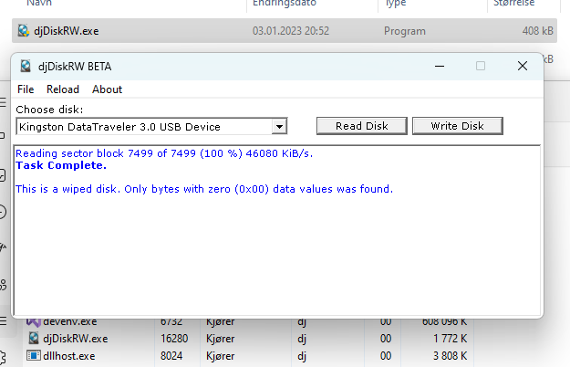

## djDiskRW | Reading and Writing Zero Disk Sectors
A small C++ tool I wrote for reading and writing all sectors on a disk. Mainly for fun.

When buying a new or used disk, there may be undiscovered bad sectors (beyond acceptable reserve sectors tagged by OEM) that SMART will only report about after attempting to use them. This program lets me easily read every sector on a new drive and then check SMART to see if anything was detected, and more confidently decide it's truly ready for dependable usage. Before selling or discarding a disk, I may also want to securely(*) wipe it by writing zero to all sectors.

## Technical notes 
Uses ~3 MB ram. File is a ~410 kB sized portable x64 Win32 program, no install or footprint. 

**Read Disk** 
* Reads entire surface, 1MiB at a time. Will detect any non-zero sector bytes. This serves to both verify a wipe, and trigger any rarely used sectors in SMART. 

**Write Disk** 
* Writes entire surface, 1MiB at a time. Will verify and detect any non-zero written byte. This serves to both securely(*) wipe a disk, and trigger any rarely used bad sectors in SMART. 

* If a written byte could not be verified as being zero, it will continue to write, but you should definitely check its SMART status and consider physically destroying it if discarding. 

* When detecting drives, a red colored note will indicate the index 0 disk, as usually system disk. Indexes and letters are not reliable 100% indicators, even less when used from live boot images. So don't trust the index. The responsibility of choosing a correct target disk, falls on the user. 

**Of course, I've tested writing to a live booted system disk on a test computer from within Windows 11:** 
Start sectors got written before I got access denied, and effectively ruined the partition table. This was very easily fixable via AOMEI Partition Assistant I have on my USB iso tool stick. I converted back to GPT and rebuilt the boot partition with bcdboot. All fixed in under 5 minutes. It was very limited how much damage I was allowed to do on a live online system. 

## Additional notes 
* Keeps system awake during reading and/or writing. 
* Multiple instances of the program can run at the same time. 

**) Some people care about semantics and pedantry more than what works for its purpose. They may have concern about the nature of remaining flipped bits on flash storage. A few bits is not going to provide enough data for typical user data where any meaningful data will require multiple bytes. I have never been able to read enough bits back to even make _any_ written zero byte anything else than still 0x00.*